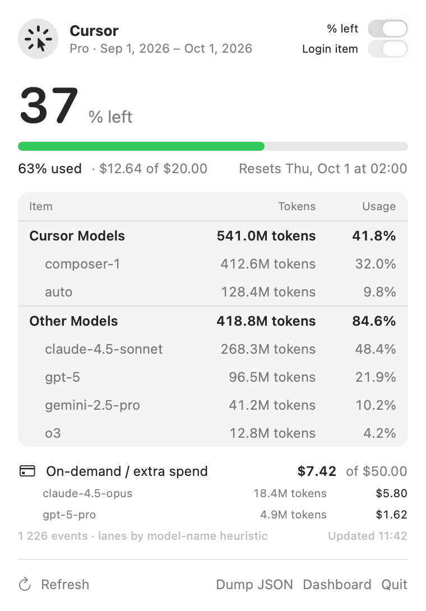

# Cursor Usage

A small macOS menu bar app that shows how much of your Cursor plan you've used
this billing period, with the same per-model breakdown as the Cursor dashboard.

The menu bar shows a percentage (`37%`), turning orange at 70% and red at 90%.
Click it for the details:

<p align="center">
  <picture>
    <source media="(prefers-color-scheme: dark)" srcset="docs/popover-dark.png">
    
  </picture>
</p>

No dependencies, no accounts, nothing stored. It reuses the login session of
the Cursor app already on your Mac.

## Requirements

- macOS 14 or newer
- Xcode Command Line Tools (`xcode-select --install`) or Xcode
- Cursor installed and signed in

## Getting started

Clone and install:

```bash
git clone https://github.com/jashuari/CursorUsage.git
cd CursorUsage
make install
```

That builds a release `.app`, copies it to `/Applications`, and launches it.
The app registers itself to start at login on first launch, so it will be back
after a reboot. A percentage should appear in your menu bar within a few
seconds.

To try it without installing (quits when you press Ctrl-C):

```bash
make run
```

## Everyday use

- **Click** the percentage to open the popover with the breakdown.
- **Left / used toggle** in the popover switches what the menu bar number means.
- **Login item switch** in the popover turns start-at-login on or off. You can
  also do this in System Settings → General → Login Items & Extensions.
- **Refresh** happens every 5 minutes, and when you open the popover if the data
  is more than a minute old.

## Uninstall

```bash
pkill -x CursorUsage; rm -rf /Applications/CursorUsage.app
```

Then remove it from Login Items in System Settings if it's still listed.

## Troubleshooting

**Nothing appears / "not signed in".** The app reads the session token from
the Cursor app's local state. Open Cursor, make sure you're signed in, then
open the popover again to retry.

**Numbers look wrong or the app stopped working.** Cursor's dashboard API is
undocumented and changes without notice. Run `make dump` to print the raw
responses and see what changed.

**The Cursor Models vs Other Models split doesn't match the dashboard.** The
dashboard uses a per-event field to decide this that isn't obvious from the
API. The app tries a few likely field names and otherwise guesses from the
model name. The popover footer says which rule was used. To fix it, run
`make dump`, compare one `auto-smart` event from each group, and adjust
`LaneClassifier` in `Sources/CursorUsage/UsageReport.swift`.

## How it works

- **Auth:** reads the access token from Cursor's state database
  (`~/Library/Application Support/Cursor/User/globalStorage/state.vscdb`) and
  sends it as the `WorkosCursorSessionToken` cookie. Read-only, re-read on every
  refresh, never written anywhere.
- **Data:** `GET /api/usage-summary` for plan percentages and billing cycle,
  `POST /api/dashboard/get-filtered-usage-events` for the per-model breakdown,
  aggregated on your Mac.

## Development

| Command | What it does |
| --- | --- |
| `make run` | Debug build, runs in the foreground |
| `make dump` | Prints raw API payloads to stdout and `~/Library/Logs/CursorUsage/` |
| `make app` | Builds `CursorUsage.app` in the project folder |
| `make screenshot` | Re-renders the README images in `docs/` from sample data |
| `make install` | `make app` + copy to `/Applications` + launch |
| `make clean` | Removes build output |

| File | Role |
| --- | --- |
| `App.swift` | Entry point, menu bar item, popover, `--dump` mode |
| `CursorAuth.swift` | Reads the token from Cursor's SQLite state DB |
| `CursorAPI.swift` | HTTP client and response models |
| `UsageReport.swift` | Groups events into lanes and per-model rows |
| `UsageStore.swift` | Refresh timer and UI state |
| `PopoverView.swift` | SwiftUI popover |
| `LaunchAtLogin.swift` | Login item registration |
| `ScreenshotMode.swift` | Renders the README images from sample data |
